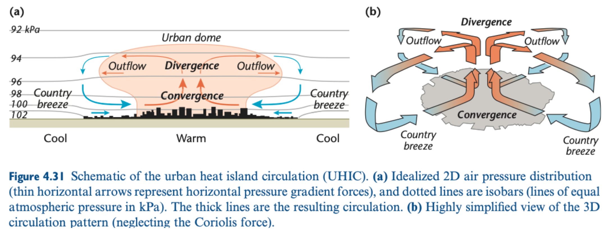

# The hunt for city-driven atmospheric circulation (hk25-CityCirc)

#### Project Lead: TBD

#### Project members: Mathew Lipson

#### Number of open slots for students:

#### Expertise needed:

None

### Project Description

#### Background:

Urban heat islands, where cities are warmer than their surrounds, can induce atmospheric flows similar to a land-sea breeze. The warmer urban surface induces thermal updrafts, increasing boundary layer height and encourages converging horizontal wind fields. These can lead to lower levels of air pollution, with polluted city air being vented into the upper atmosphere, and clearer “country” air replacing it.

Ideal conditions for this urban heat island circulation are light synoptic flows and clear skies. Other important aspects are the complexity of surrounding areas (mountains, oceans, lakes?), the roughness and materiality of the city, and anthropogenic waste heat released from the city. 

Do \~5km global simulations capture these urban-induced flows? If so, which cities are most affected, in what conditions and at what times of day?

 
Source: Oke et al., 2017, page 115\.

#### Primary research question:

Find which cities and under which conditions have the strongest urban-induced atmospheric circulations.

#### Secondary research questions:

How does the urban representation in a model affect urban-induced circulations.

#### Primary output:

Plots

#### Secondary outputs:

### Methodology

#### Datasets: 

Variables needed from the Hackathon, 2D/3D, over which region?   
Other datasets (observations etc)

#### Methods:

Further reading: 

* Urban Climates: Oke et al., 2017: Book chapter 4.4.2   
* Buoyancy and turbulence-driven atmospheric circulation over urban areas: Fan et al., 2017: [https://doi.org/10.1016/j.jes.2017.01.009](https://doi.org/10.1016/j.jes.2017.01.009)  
 

