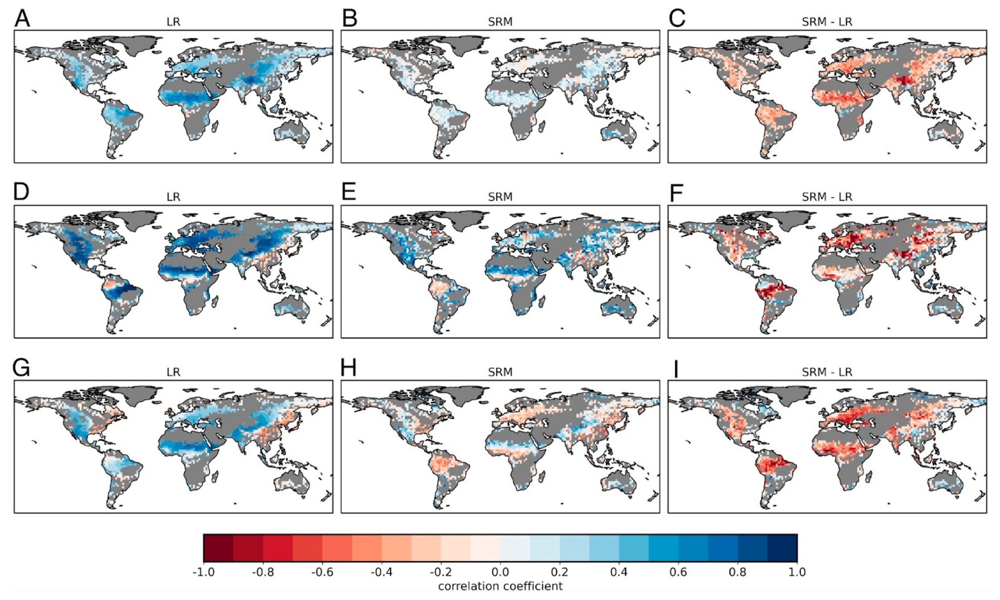

# Precipitation/soil moisture feedback: positive or negative? (hk25-Land)

#### Project Lead: Mathew Lipson (m.lipson@unsw.edu.au)

#### Project members:

#### Number of open slots for students: 4

#### Expertise needed:

None

### Project Description

#### Background:

There is ongoing debate on whether soil moisture is positively or negatively correlated with precipitation. This has huge implications for future climate, storms, drought and land cover change: i.e. will lower soil moisture lead to lower local precipitation, leading to lower soil moisture and so on? Our current global climate models (e.g. for CMIP6) indicate a strong positive feedback, while km-scale models indicate a weak or negative feedback.

A recent study ([Lee and Hohenegger, 2024](https://doi.org/10.1073/pnas.2314265121)) compared global year-long 5km simulations with 60-year 160 km resolution simulations more typical of climate simulations, both using the ICON model. They examined the northern hemisphere (boreal) summer, and found weaker and more negative soil moisture/ precipitation feedback in high resolution simulations, with some regional differences. While interesting, the results have little bearing on Australia, as results are analysed during our northern dry season with little to no rain.

This Hackathon provides the necessary data to test whether resolution is important in soil moisture/ precipitation feedbacks, and how important that is for Australia.

#### Primary research question:

* Can we reproduce the results of Lee and Hohenegger 2024 for an Austral summer?  
* If so, what are the implications for Australia?

Secondary research questions:

* How do the correlation differences compare across different models?  
* Can we resolve the important processes and precedent conditions that lead to positive/negative feedback?  
* What are the timescales of important feedbacks? (hours, days, weeks?)  
* What is the impact of soil moisture differences on storm/ hail/ precip conditions

#### Primary output:

Plots similar to [Lee and Hohenegger 2024](https://doi.org/10.1073/pnas.2314265121), e.g.:

#### Fig 1\. Correlation coefficients computed based on daily mean values for June–July–August between (A–C) SMI and precipitation, (D–F) SMI and evapotranspiration, and (G–I) evapotranspiration and precipitation for the 60-y mean of the coarse-resolution model (LR), the SRM, and the resulting difference in correlation coefficient (Materials and Methods). Areas where precipitation is smaller than 0.1 mm d in both simulations (called non-rainy area, corresponding to 21.8% of the land area) or where the SMI-precipitation correlation coefficient of the SRM is within one SD of the year-to-year variability of the correlation coefficient in the coarse-resolution model (53.2% of the rainy area) are masked in gray.

#### Secondary outputs:

Paper

### Methodology

#### Datasets: 

Region: global  
Models: all available with convection permitting and convection parameterised version  
Primary variables: soil moisture, precipitation,   
Secondary variables: surface energy fluxes, convection-related parameters (CAPE, CIN, vertical wind speeds, clouds etc)  
Other datasets: 

- CMIP-style (classic climate) simulations of equivalent models  
- AGCD to examine daily observed feedbacks at 5km resolution

#### Methods:

1. All read [Lee and Hohenegger, 2024](https://doi.org/10.1073/pnas.2314265121) methods and discuss with group  
2. Split up to read other relevant literature and summarise to group  
3. Read over Lee and Hohenegger [github python code](https://github.com/junhonglee89/PNAS_land-atm_coupling_in_global_SRM) for paper, discuss problems  
4. Split into groups of two to write code to 1\) reproduce Lee and Hohenegger 2\) analyse ACDC observations for Australia 3\) if not part of available outputs, calculate CAPE, CIN (hopefully other groups need these variables also)  
5. Come together to write draft paper

Further reading:

* On the Physics of High CAPE (Emanuel 2023): [https://doi.org/10.1175/JAS-D-23-0060.1](https://doi.org/10.1175/JAS-D-23-0060.1)

