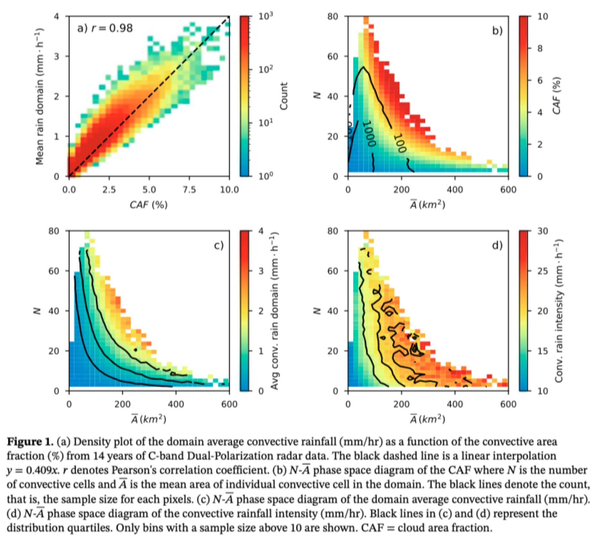

# The relationship of cloud size and number with large-scale environment for precipitation in high-resolution models (hk25-LargeScaleP)

### Project Details

#### This project overlaps with the Mesoscale Degree of Organization [hk25-DOCmeso](/hk25-DOCmeso/README.md) project led by Philip Blackberg. We will finish our primary output first before merging together to relate environmental conditions to hk25-DOCmeso.

#### Project Lead: Dongqi Lin (Dongqi.Lin@monash.edu)

#### Project members: Yi-Xian Li

#### Number of open slots for students: 4-6

#### Expertise needed:

Basic skills in Python and Xarray. Tropical convection knowledge would be a plus but not required. 

### Project Description

#### Background:

Simulating clouds remains one of the greatest challenges in global climate models. Convective clouds, in particular, are often much smaller than the grid size of traditional global climate models. As a result, these models rely on convective parameterisation schemes that assume quasi-equilibrium between the large-scale environment and the convective processes within each grid box. However, as model resolution gets finer, this assumption breaks down — especially when convection occupies a significant portion of a grid cell.

Louf et al. (2019) examined how the size and number of clouds relate to their large-scale environment in regions of deep tropical convection. Using radar data from Darwin, Australia, and environmental conditions derived from a blend of ECMWF analyses and observations, they found that the strongest rainfall doesn't always align with the most intense convection at the model grid scale.

In this Hackathon, we are using high-resolution models that omit several traditional parameterisations, including those for convection, gravity waves, and the boundary layer. However, removing these schemes introduces new challenges: some high-resolution models may now produce storms that are smaller than those presented in the observations. This project explores whether these high-resolution models can reproduce the environmental conditions and precipitation patterns similar to those in Louf et al. (2019), and how these features differ across models.

#### Primary research question:

Can high-resolution models reproduce the environmental conditions and precipitation patterns similar to those in the observations?

#### Secondary research questions:

What is the relationship between the environmental conditions, cloud area fraction, and degree of organisation?

#### Primary output:

What is the main output you expect? A comparison of something in the simulations to observations? A piece of software? Be as specific as you can. Also be realistic \- make this achievable in a week.  
The very first step is to replicate the key results from Louf et al. (2019) by comparing cloud number and size with environmental conditions, using Darwin radar observations, ERA5, and high-resolution model outputs. Convective cells will be identified using a simple precipitation threshold, consistent across observations and models, to avoid discrepancies in cell detection methods. No cell tracking is required — convective cells can be extracted using standard Python tools such as scikit-learn. Environmental variables to be analyzed include CAPE, CIN (with calculation scripts provided), as well as relative humidity and vertical velocity at 500 hPa, which are available directly from the model outputs. This comparison will allow us to assess whether the simulated precipitation and environmental conditions align with those observed.

The two main figures from Louf et al. (2019):  
  

#### Secondary outputs:

Code for CAPE and CIN can be shared. If we further answer the secondary question around the degree of organization, and extend similar analysis to the entire tropics, this can potentially be a paper. For this Hackathon, the DOC will be calculated for the area covering the maritime continent and northern Australia. We can also look into why different models behave differently, and what’s causing the differences between models and observations. 

Yi-Xian can add his top-heavy/bottom-heavy omega (*w*) analysis if we make amazing progress.

### Methodology

#### Datasets: 

Variables needed from the Hackathon, 2D/3D, over which region?   
Other datasets (observations etc)

* Region of interest: northern Australia and the maritime continent  
* 2D output variables (1hr instantaneous): precipitation\_flux (pr), toa\_outgoing\_longwave\_flux (rlut)  
* 2D output variables (3hr mean): precipitation\_flux (pr), toa\_outgoing\_longwave\_flux (rlut), cloud\_area\_fraction (clt)  
* 3D output variables (6hr instantaneous): upward\_air\_velocity (wa), relative\_humidity (hur), temperature (ta)  
* Darwin radar and ERA5 are available on NCI  
* Potentially any radar in the tropics if anyone or any node has the data

#### Methods:

The code to calculate CAPE and CIN will be available, but I’m not sure how well it will be adapted to the HEALPix grid, so everyone can contribute here. Require Python, and packages like xarray, dask, metpy etc. Will need to discuss the thresholds for convective cell identification. I’ll provide code on how to replicate the figures in Louf et al. (2019), but members can come up with different ways for plotting \- be creative\!

Can split the task to members based on the number of models, for example, one person per model. Half of the members will work on the environmental conditions and the other half will compute the cloud area fraction, cloud number, and cloud size. 

### Reference

Louf, V., Jakob, C., Protat, A., Bergemann, M. and Narsey, S., 2019\. The relationship of cloud number and size with their large‐scale environment in deep tropical convection. Geophysical Research Letters, 46(15), pp.9203-9212.
