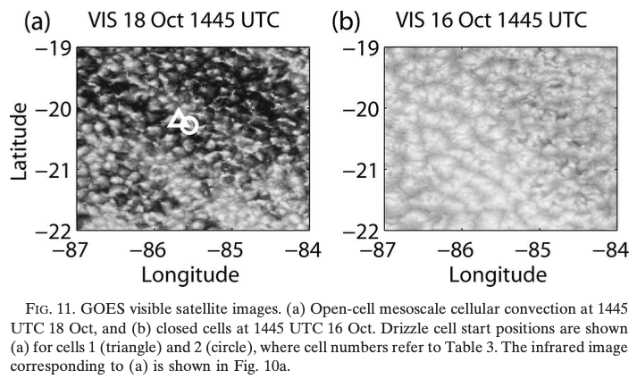
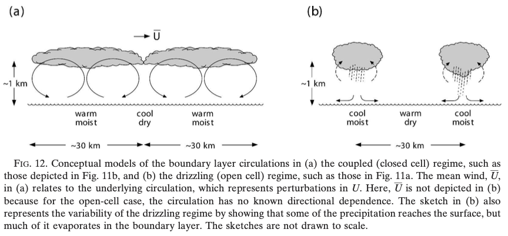
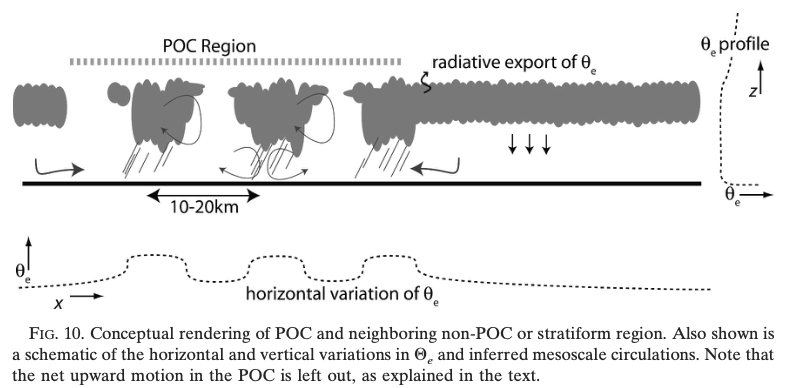
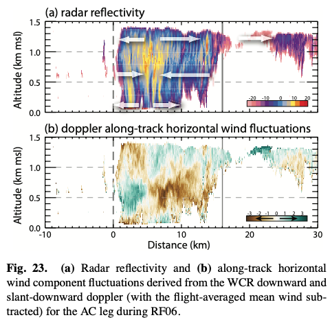
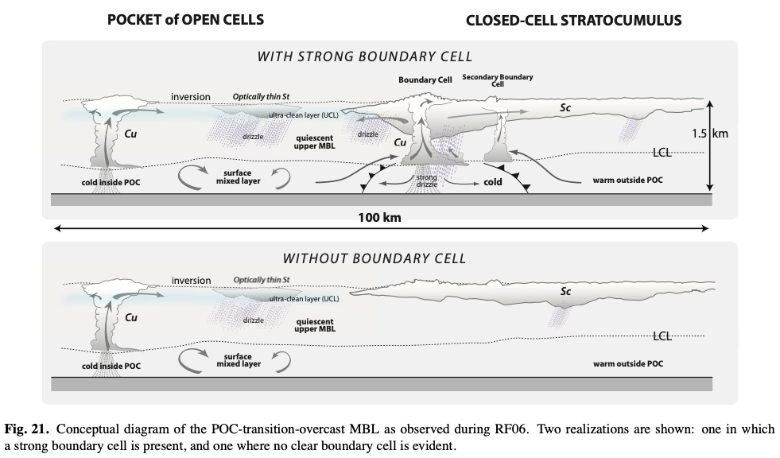

# Mesoscale structure of stratocumulus (hk25-StCu): pre-hackathon notes

Jakub Nowak (jakub.nowak@mpimet.mpg.de)


### Regions and seasons

Classical 4 subtropical eastern ocean basins

- 10 x 10 deg domains from [Klein and Hartmann 1993](https://doi.org/10.1175/1520-0442(1993)006<1587:TSCOLS>2.0.CO;2)
```python
domains10x10 = {
    "peruvian":     np.array([-90, -80, -20, -10]) ,
    "namibian":     np.array([0, 10, -20, -10]),
    "californian":  np.array([-130, -120, 20, 30]),
    "canarian":     np.array([-35, -25, 15, 25])
}
```
- 4 x 4 deg domains in the middle of the above, used in [Nowak et al. 2025](https://doi.org/10.1029/2024MS004340)
```python
offset = np.array([3, -3, 3, -3])
domains4x4 = {name: coords+offset for name, coords in domains10x10.items()}
```

The month of maximum observed albedo in those domains is July for Canarian and August for the other three.


### Morphology metrics

Nonexhaustive list of a few cloud morphology metrics I encounterd in literature.


#### [Wood and Hartmann 2006](https://doi.org/10.1175/JCLI3702.1): statistics of liquid water path

Probability distributions
   - nondimensional homogeneity parameter $(\left<LWP\right>/\sigma_{LWP})^2$
   - skewness and kurtosis

2D power spectrum
<!--   - The image is first detrended by removing the best-fit plane and then windowed using a Welch window. -->
   - The spectrum is a function of total wavenumber $k^2=k_x^2+k_y^2$
   - Two characteristic lengthscales are derived from the spectrum:
      - peak wavelength $\lambda_1$ can be interpreted as the approximate diameter of mesoscale convective cells
      - wavelength where the spectrum deviates from power law (which is usually observed at the smallest scales) $\lambda_2$ can be interpreted as the typical size of clouds inside the cells.


#### [Wood et al. 2008](https://doi.org/10.1029/2007JD009371): variance of band-pass filtered IR brightness temperature

This metric was designed to detect pockets of open cells (POC) which exhibit higher mesoscale variability than their surrounding in the GOES IR satellite imagery.
A discrete wavelet transform is used as a method of band-pass filtering.

- Select a wavelet function and order. In practice, the order corresponds to the specific range of scales.
- Apply a discrete wavelet transform to each row of a 2D matrix and replace the values by the transform coefficients of the selected order.
- Repeat the operation for the columns.
- Take the square of the wavelet coefficients and smooth such a field with a running median of a rather large window.


#### [Koren et al. 2024](https://doi.org/10.1029/2024GL108435): cloud vs void chord length distributions (LvL)

- Rearrange an input binary field into a concatenated 1D vector by glueing sequentially. Do this flattening in both vertical and horizontal directions.
- Compute two probability distributions: of cloud-chord lengths and void-chord lengths.
- Compare them with the analogous distributions for a random field with the same cloud fraction $p$.
    - The normalized random cloud-chord length distribution is $p^{L-1}(1-p)$ and the normalized random void-chord length distribution is $(1-p)^{L-1}p$.
    - The deviation of the observed distributions from randomness is measured with a goodness-of-fit score based on the Kolmogorov-Smirnov test.
- LvL score consists of two components, for cloud and voids, forming the 2D LvL space.
- LvL fails when cloud fraction is 0 or 1!

There is a python [function](tools/LvL.py) provided in [Koren et al. 2024 \[software\]](https://doi.org/10.34933/b7f2cded-40d3-4be9-bdc6-31b2694ca49c)


#### [Bagioli and Tompkins 2023](https://doi.org/10.1175/JAS-D-23-0103.1): Iorg and Lorg

This metric may be insuitable for stratocumulus clouds if they correspond to large connected objects but it can be verified. 

Iorg
- Segment the binary field into connected objects.
- For each object, compute the distance from its centroid to a nearest neighbour.
- Derive the cumulative density function of nearest neighbour distances NNCDF(r).
- Plot the observed NNCDF against the NNCDF of a random field which is is a Weibull distribution $1-\exp(\lambda\pi r^2)$, where $\lambda$ is mean density of objects.
- Integrate the area under the graph to obtain Iorg.
- Iorg = 0.5 indicates randomness, Iorg > 0.5 clustering, Iorg < 0.5 regularity.

<!-- ( Iorg = 0.5 does not guarantee random distribution of objects because it integrates over all scales. There may be a superposition of clustered and regular subdistributions which appear at different scales. -->

Lorg
- Instead of NNCDF(r), derive the distribution of number of neighbours NN(r) closer than r.
- Compute a radius of a disk which would include the same NN in the case of a random field, i.e. $\lambda\pi L^2=NN(r)$
- Plot $L(r)/r_{max}$ vs $r/r_{max}$ where $r_{max}$ is the maximum possible distance between the objects in the considered domain.
- Integrate the area under the graph to obtain Lorg.

There is a python [function](tools/ILorg.py) provided in https://github.com/giobiagioli/organization_indices.


### Concepts for mesoscale organization in stratocumulus

#### [Comstock et al. 2005](https://doi.org/10.1175/JAS3567.1)

Observations: research vessel at a fixed location + permanent buoy

Methods
- power spectra and cross-spectra analysis of timeseries
- extraction of mesoscale with a bandpass filter (~10-100 km)
- segmentation of ship observation into 3 classes: coupled, less-coupled, drizzling
- tracking of drizzle cells with a scanning radar

Evidence
- mesoscale surface **along-wind convergence in warm** regions and divergence in cooler regions
- correlations of mesoscale fluctuations
    - coupled regime: low variance; **warm+moist** updrafts below thicker cloud with lower cloud base and higher cloud top
    - drizzling regime: high variance; **cool+moist** downdrafts below thicker clouds with lower cloud base
- diurnal cycle of the regimes: coupled dominates in the night, drizzling in the early morning, less-coupled in the afternoon
- drizzle cells persistent for a few hours
- typical scale of closed and open cells 15-60 km

Hypotheses
- The coupled regime is associated with closed cells, the drizzling with open cells, the less-coupled with afternoon cloud thinning.
- In the drizzling regime, some vertical mixing must be occurring throughout the BL so that moisture is provided into the cloud. Moist updrafts could appear beneath clouds but are not evident at the surface or distorted by the evaporatively cooled downdrafts.

<!--  -->



#### [van Zanten and Stevens 2005](https://doi.org/10.1175/JAS3611.1)

Observations: research aircraft in DYCOMS-II campaign

Methods
- segmentation into 3 classes: pockets of open cells (POC), drizzling areas inside POC, non-POC

Evidence
- POC vs nonPOC:
colder, moister, **higher $\theta_e$**,
precipitating, higher LWP, lower CDNC, higher droplet effective radius,
reduced vertical velocity variance below the cloud.
- The POC, in particular the drizzling areas, have **mean upward velocity** while the non-POC have **mean downward velocity**.
- Over the POC, fluctuations in **$q_v$ and $\theta$ are negatively correlated** on scales of 10–20 km.
- Moisture budget indicates net BL drying in POC and net moistening in non-POC.

Hypotheses
- The enhanced $\theta_e$ in the wide POC regions can be caused by:
    - reduced radiative cooling associated with more broken clouds,
    - a larger **mesoscale circulation implied by the vertical velocity**,
    - entrainment of air richer in $\theta_e$.
- The even more enhanced $\theta_e$ in drizzling cells inside POC can be caused by:
    - baroclinic circulations damping horizontal differences in $\theta_v$
    - **increased surface fluxes** due to larger wind speeds related to the spreading of precipitation-induced cold pools,
    - radiative fluxes exporting $\theta_e$ from the clear regions but increasing $\theta_e$ near the cloud base in the saturated regions.

The counterpart to the circulation due to precipitation-induced cold pools in the subcloud layer would be the reversed circulation above cloud base with **convergence in the middle of the BL**.




#### [Wood et al. 2011](https://doi.org/10.5194/acp-11-2341-2011)

Observations: research aircraft flight in VOCAL-REx campaign

Methods
- sampling the transition between pockets of open cells (POC) and overcast stratocumulus in a number of very long horizontal legs
- segememtation into 3 classes: POC, overcast, transition zone (distinguished subjectively from cloud radar)

Evidence
- POC vs overcast
    - surface thermodynamics: lower $T$, higher $q_v$, smaller LHF, larger SHF
    - stratification: signitures of BL decoupling in $\theta_l$ and $q_t$, weaker inversion at cloud top
    - distribution of cloud properties
        - **LWP: broader and more positively skewed** <!-- (but mean in-cloud LWC approximately equal) -->
        - cloud top height: broader and bimodal
        - cloud base height: bimodal with lowest bases corresponding to Cu and highest to Sc/St
        - cloud base rain rate: broader (+higher fraction reaching the surface)
    - **most of the condensate in the form of drizzle**: $q_r/q_l=$ 3 (POC), 4 (transition), 0.25 (overcast)
    - cloud types
        - thick, rather broad (few km) active Cu containing one or more updraft cores
        - thin, queiscent St where the total condensate is roughly the same but almost entirely in the form of drizzle
- Transition zone
    - The boundary is rather uneven, 16-43 km wide, consists of cellular ~20-40 km strongly precipitating cloud cells (but there are also sections where there is no boundary cell).
    - Cloud-base rain rate much stronger than in both POC and overcast. Almost everything reaches the surface.
    - **Multilevel circulation**: 
strong cold+moist pool drives outflow at low levels; 
significant mid-level inflow into the boundary cloud cell;
outflow at the cloud level.


Hypotheses
- Stronger turbulence in the overcast region drives stronger entrainment than in the POC. However, there is no difference in MBL depth which suggests **weaker subsidence in the POC**, so there may be compensating circulation between the overcast and POC.
- Mesoscale updrafts in the POC may prolong the timescale over which drizzle can remain in cloud, and potentially the cloud lifetime.




### Relevant simulations

| Simulation | Protocol | Mod res (km) | Av type | Time res | Zoom | Out res (km) | 3D variables | 2D variables |
| --- | --- | ---: | ---: | ---: | ---: | ---: | --- | --- |
| icon_d3hp003 | atm DYAMOND3 | 2.5 | inst | 6H | 11 | 3.2 | hus qall ta wa | pr rsut |
| icon_d3hp003aug | atm DYAMOND3 1-day | 2.5 | inst | 15M | 11 | 3.2 | hus qall ta wa | pr rsut |
| ngc3028* | coupled perpetual 2020 | 5 | mean | 30M | 10 | 6.4 | --- | cllvi pr prw qrvi rsds rsut |
| ifs_tco3999-ng5_rcmbf | coupled DYAMOND3 | 2.8 | ? | 1H | 11 | 3.2 | cc clwc crwc q t w | blh lcc tcc tclw tcrw tcwv tprate (instant?) +  fdir lsp tp tsr (accum?) | 
| ifs_tco3999-ng5_rcmb_cf | coupled DYAMOND3 | 2.8 | ? | 1H | 11 | 3.2 | hus qall ta wa | clt clwvi lcc prw tcrw tprate (instant?) + fdir lsp pr rsds (accum?) |
| ifs_tco3999-ng5_rcmbf_deepoff | coupled DYAMOND3 | 2.8 | ? | 1H | 11 | 3.2 | cc clwc crwc q t w | blh lcc tcc tclw tcrw tcwv tprate (instant?) +  fdir lsp tp tsr (accum?) | 

*nextGEMS catalog: `https://data.nextgems-h2020.eu/catalog.yaml`


### Dictionary of variables

#### Selected ICON variables

| key | short name |
| --- | --- |
| cllvi	| vertically integrated cloud water |
| hus	| specific humidity |
| pr	| precipitation flux |
| prw	| vertically integrated water vapour |
| qall	| mass fraction of all hydrometeors in air |
| qrvi	| vertically integrated rain |
| rsds	| surface downwelling shortwave radiation |
| rsut	| toa outgoing shortwave radiation |
| wa	| vertical velocity in m/s|

#### Selected IFS variables

| key | short name |
| --- | --- |
| blh	| Boundary layer height |
| cc	| Fraction of cloud cover |
| clwc	| Specific cloud liquid water content |
| crwc	| Specific rain water content |
| fdir	| Total sky direct short-wave (solar) radiation at surface |
| lcc	| Low cloud cover |
| lsp	| Large-scale precipitation |
| q	    | Specific humidity |
| ssrd	| Surface short-wave (solar) radiation downwards |
| t	    | Temperature |
| tcc	| Total cloud cover |
| tclw	| Total column cloud liquid water |
| tcrw	| Total column rain water |
| tcwv	| Total column vertically-integrated water vapour |
| tp	| Total precipitation |
| tprate | Total precipitation |
| tsr	|Top net short-wave (solar) radiation |
| w	    | Vertical velocity |


### Healpix grids

<!--
```python
nside = 2**zoom
ncells = 12*nside**2
```
-->

| zoom | nside | res. (km) | ncells  |
| ----:| -----:| ---------:| ----------:|
|    0 | 	1 |	6519.6 | 12 |
|    1 | 	2 |	3259.8 | 48 |
|    2 | 	4 |	1629.9 | 192 |
|    3 |   	8 | 	815.0 | 768 |
|    4 |	16 | 	407.5 | 3,072 |
|    5 |	32 | 	203.7 | 12,288 |
|    6 |	64 | 	101.9 | 49,152 |
|    7 |   128 |  	50.9 | 196,608 |
|    8 |   256 |  	25.5 | 786,432 |
|    9 |   512 |  	12.7 | 3,145,728 |
|   10 |  1024 |   	6.4 | 12,582,912 |
|   11 |  2048 |   	3.2 | 50,331,648 |
|   12 |  4096 |   	1.6 | 201,326,592 |


