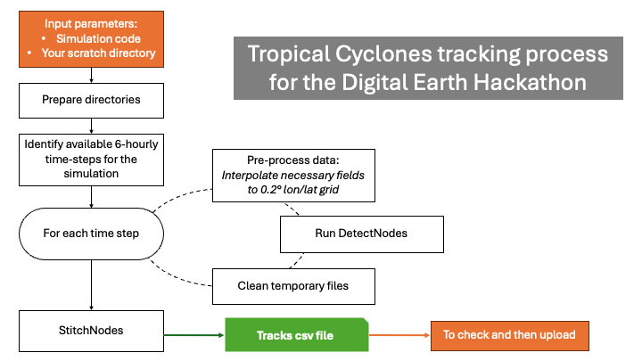

# Tropical Cyclones (hk25-TropCyc)

Tropical Cyclones (TCs) are intense organised convective systems that are responsible for nearly half of the worldwide disaster-related costs (CRED & UNDRR, 2020). Historically, they have been difficult to represent in coarse-resolution climate models because of their small size and their sensitivity to convective parametrisations. It has been shown that increasing resolution to 25km allows models to represent the number and distribution of cyclones correctly (Roberts et al. 2020), but the intensity remains largely underestimated, and the structure is not well represented (Bourdin et al. 2024). Baker et al. (2024) showed that increasing resolution up to 5km improves the realism of intensity, intensification rate, lifecycle and structure of TCs in NextGEMS simulations.

In this team, we will investigate how TCs are represented in the new sets of simulations in terms of statistics, structure, lifecycle and link with the environment.

**Coordination**: Stella Bourdin (stella.bourdin@physics.ox.ac.uk), Alex Baker (alexander.baker@reading.ac.uk), Arthur Avenas (arthur.avenas@esa.int), Xu Chen (chenx@g.ecc.u-tokyo.ac.jp)

Sketch of initial activities:
* Track TCs in the simulations using TempestExtremes -> Assess TCs statistics, particularly in terms of intensity and intensification rates
* Retrieve snapshots of tropical cyclones’ structure -> Assess tropical cyclones structure
* Retrieve/compute variables associated with environmental favourability for TC (e.g. GPI) -> Assess how the environment controls TCs, particularly the moisture field and the components of Potential Intensity
* Comparison of TC tracks from re-analyses / models and from satellite observations

*Find the link to the Monitoring Google Sheet on Mattermost, it is kept out of the public GitHub to avoid potential issues.*

## First steps

1. Introduce yourself as a member of the team:
* Say Hi in this channel, introduce yourself, your relevant experience/skills (if close to none, that fine!), and your goals for this hackathon within the team
* Go the the Monitoring Google sheet linked at the top of this channel, into the "Members" tab, and register you name, address and mattermost handle (might be needed for communication after the event).
* If your node does not already have a designated member as point of contact, you can volunteer yourself.
* If you are in-person at a node, try to find the other members from that node to work together!

2. Acknowledge the available resources:

* How to Hack 2025 page on Github
* Science Plan
* Your node documentation
* HuracanPy may be a useful tool for your analyses.

3. Prepare your working environment:

* Install your hackathon environment following instructions provided for your node/machine
* Install tempestextremes in that environment
* Fork and clone the hk25-teams or its hk25-TropCyc subset git as a working space.

## TC tracking

The first and main task will be the tracking of the tropical cyclones in as many simulations as possible.
To coordinate this, check out the Monitoring sheet, especially the "Plan" for steps and "TC tracks" tabs.

Following these steps will help make sure we are the most efficient, without the same simulation being tracked several times, and consistent, with the same algorithm being applied to all simulations

1. Identify the simulations to be tracked by you or your team.
These may be simulations that are stored at your node, hence easier to access, or simulations you are really interested in and want to be sure someone takes care of them.
If necessary, exchange on the Mattermost channel to coordinate with other people.
-> Update the Monitoring TC tracks tab with the simulation you want to track

2. Distribute the tracking tasks among the team members -> Update the Monitoring TC tracks tab with the handles of the responsible members for each simulation

3. Get familiar with the tracking process: Check-out the pre-processing, TE_intro and TE_full notebooks to understand how it works.

4. Run the tracking with the full_tracking notebook (or turn it into a script if necessary).

5. Check the tracks you obtained (An image will be generated at the end of the full_tracking script to get a first glance.

6. Upload the tracks to hk25-TropCyc/TC_tracks/ with one csv file per simulation, named with the simulation code. Update the Monitoring TC tracks once this is done

*Technical details*:
TCs are to be tracked in all relevant simulations (i.e. simulations covering TC-prone areas) using TempestExtremes and the algorithm described in Ullrich et al. 2021.
Output should include, a minima, track_id, time, lon, lat, maximum wind speed in a 2°GCD radius and minimum SLP.

Note: If some simulations don't have the necessary data for the tracking, an alternative 2D algorithm can be applied - please reach out if that's the case.

