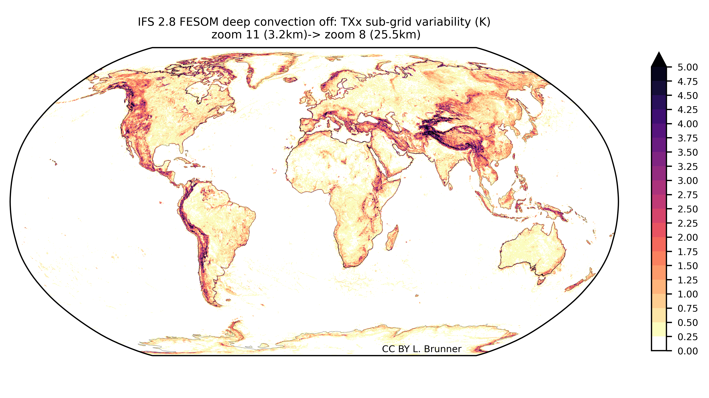

# Global representation of local extremes (hk25-lx1)

Climate extremes can develop on a wide range of spatial scales from continental to local. Global km-scale models allow us a global view on such extremes with local detail important for impacts for the first time. Here, we will use them to quantify the spatial variability lost at coarser resolutions typical for established global models (e.g. from CMIP6 or HighResMIP). This will allow us to identify regions where output resolution matters for the representation of extremes and build understanding of the underlying processes. Comparing km-scale models will enable us to analyses cases where models agree or diverge and trace them back to model differences, for example in the treatment of deep convection.

In this team we will test what the added value of high-resolution output is for the spatial representation of climate extremes. We also aim to understand potential differences between models.

**Coordination**: Lukas Brunner (lukas.brunner@uni-hamburg.de)

### Sketch of initial activities
* Calculate extreme indices (e.g., [ETCCDI](https://etccdi.pacificclimate.org/list_27_indices.shtml)) at the highest available resolution from all available models
* Analyze what and where spatial variability is lost at coarser resolutions
* Compare different extreme indices and models and understand disagreements

